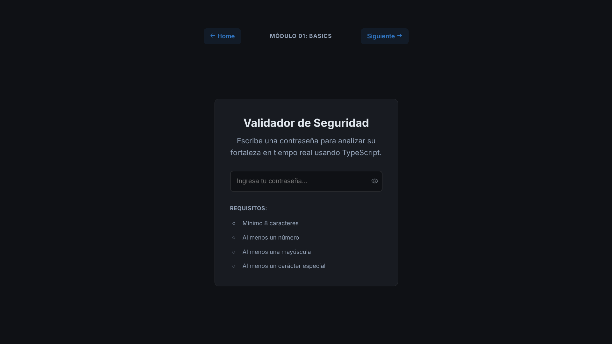

# Módulo 01: Validador de Seguridad (Basics)

Este proyecto es una herramienta interactiva desarrollada con **TypeScript** que analiza la fortaleza de una contraseña en tiempo real. El objetivo principal es manipular el DOM dinámicamente basándose en la entrada del usuario y expresiones regulares.



---

## 🚀 Funcionalidades

- **Análisis en Tiempo Real:** Feedback visual instantáneo mientras el usuario escribe.
- **Validación por Reglas:**
  - Mínimo 8 caracteres.
  - Al menos un número.
  - Al menos una mayúscula.
  - Al menos un carácter especial.
- **UI Dinámica:** Cambio de estilos (colores e iconos) cuando se cumplen las reglas.
- **Visibilidad de Contraseña:** Botón (toggle) para mostrar/ocultar el texto del input.
- **Feedback Global:** Mensaje de éxito animado cuando todas las condiciones se cumplen.

---

## 🧠 Conceptos Aprendidos y Aplicados

### 1. Manipulación del DOM con TypeScript

Aprendimos a seleccionar elementos y, lo más importante, a **tiparlos correctamente** para acceder a sus propiedades específicas.

```typescript
// Casting explícito para acceder a .value o .type
const passwordInput = document.getElementById(
  "passwordInput"
) as HTMLInputElement;
```

### 2. Expresiones Regulares (RegEx)

Utilizamos patrones de búsqueda (RegExp) para validar la existencia de ciertos caracteres dentro de un string.

| Patrón    | Explicación                           | Uso en Código                  |
| --------- | ------------------------------------- | ------------------------------ |
| `/\d/`    | Busca cualquier dígito (0-9)          | `patterns.number.test(value)`  |
| `/[A-Z]/` | Busca cualquier letra mayúscula       | `patterns.upper.test(value)`   |
| `/[...]/` | Busca caracteres especiales definidos | `patterns.special.test(value)` |

### 3. Manejo de Eventos (`Event Listeners`)

- **Evento `input`:** Se dispara cada vez que el valor del campo cambia (al escribir, borrar o pegar). Es ideal para validaciones en tiempo real.

- **Evento `click`:** Utilizado en el botón del "ojo" para alternar la visibilidad.

### 4. Lógica de Estado Visual (UI Feedback)

En lugar de manipular estilos CSS directamente línea por línea en JS, utilizamos clases de estado (`.valid`, `.hidden`). Esto mantiene la separación de responsabilidades:

CSS: Define cómo se ve un elemento válido.

TS: Define cuándo se aplica esa clase.

```typescript
const validateRequirement = (element: HTMLElement, isValid: boolean) => {
  if (isValid) {
    element.classList.add("valid");
  } else {
    element.classList.remove("valid");
  }
};
```
